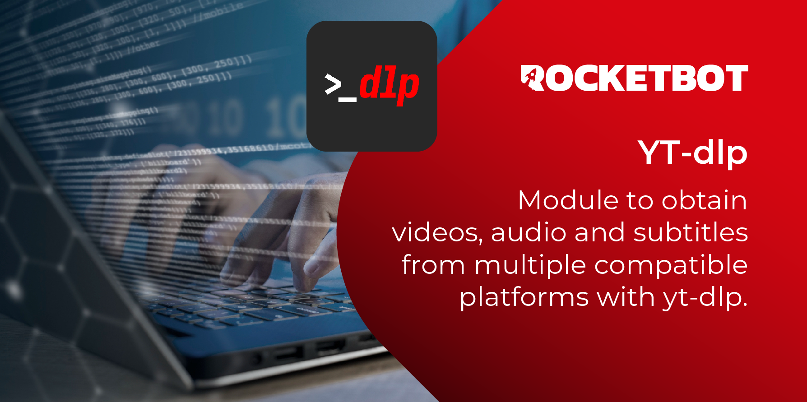

# YT-dlp
  
Módulo para obtener videos, audios y subtítulos desde múltiples plataformas compatibles con yt-dlp.  

*Read this in other languages: [English](Manual_YT-dlp.md), [Português](Manual_YT-dlp.pr.md), [Español](Manual_YT-dlp.es.md)*
  

## Como instalar este módulo
  
Para instalar o módulo no Rocketbot Studio, pode ser feito de duas formas:
1. Manual: __Baixe__ o arquivo .zip e descompacte-o na pasta módulos. O nome da pasta deve ser o mesmo do módulo e dentro dela devem ter os seguintes arquivos e pastas: \__init__.py, package.json, docs, example e libs. Se você tiver o aplicativo aberto, atualize seu navegador para poder usar o novo módulo.
2. Automático: Ao entrar no Rocketbot Studio na margem direita você encontrará a seção **Addons**, selecione **Install Mods**, procure o módulo desejado e aperte instalar.  

## Como usar este módulo
Antes de usar este módulo, você precisa instalar duas ferramentas:

1. Instale o yt-dlp

    1.1 Baixe o arquivo yt-dlp.exe de:

    https://github.com/yt-dlp/yt-dlp/releases/latest

    1.2 Crie uma pasta e coloque o executável dentro dela, por exemplo:

        C:\yt-dlp\yt-dlp.exe

    1.3 Adicione esta pasta à variável de ambiente PATH do seu sistema:

    Sistema → Variáveis ​​de Ambiente → Variáveis ​​do sistema → Editar PATH → Adicionar

        C:\yt-dlp

2. Instale o FFmpeg

    2.1 Acesse:

    https://www.gyan.dev/ffmpeg/builds/

    e baixe o arquivo .zip:

        ffmpeg-release-essentials.zip

    2.2 Extraia-o para uma pasta, por exemplo:

        C:\ffmpeg\

    2.3 Adicionar ao PATH:

        C:\ffmpeg\bin
## Descrição do comando

### Baixar Vídeo
  
Baixe um vídeo de uma URL, permitindo definir qualidade, proxy e caminho de saída.
|Parâmetros|Descrição|exemplo|
| --- | --- | --- |
|URL|Link completo do vídeo para baixar.|https://www.youtube.com/watch?v=PnMMBJiT338|
|Caminho de saída|Caminho da pasta onde o vídeo será baixado.|C:/Users/User/Videos|
|Caminho do yt-dlp|Opcional. Caminho da pasta onde o yt-dlp está instalado, para casos em que ocorre um erro por não o encontrar.|C:/Tools/yt-dlp.exe|
|Qualidade|Qualidade específica do vídeo. Execute o comando Listar Formatos para ver as qualidades disponíveis para um vídeo específico. Por padrão a melhor qualidade disponível será baixada.|best|
|Atribuir resultado à variável|Variável onde True ou False serão armazenados dependendo do sucesso do comando.|Variable|

### Baixar Audio
  
Baixe um audio de uma URL, e converta para o formato desejado.
|Parâmetros|Descrição|exemplo|
| --- | --- | --- |
|URL|Link completo do áudio para baixar.|https://www.youtube.com/watch?v=PnMMBJiT338|
|Caminho de saída|Caminho da pasta onde o áudio será baixado.|C:/Users/User/Audios|
|Formato de Áudio|Formato específico do áudio. Execute o comando Listar Formatos para ver as opções disponíveis para um áudio específico. Por padrão a melhor qualidade disponível será baixada.|mp3|
|Atribuir resultado à variável|Variável onde True ou False serão armazenados dependendo do sucesso do comando.|Variable|

### Baixar Playlist
  
Baixe todos os vídeos de uma playlist.
|Parâmetros|Descrição|exemplo|
| --- | --- | --- |
|URL|Link completo da playlist para baixar.|https://www.youtube.com/watch?v=PnMMBJiT338|
|Caminho de saída|Caminho da pasta onde os arquivos serão baixados.|C:/Users/User/Playlists|
|Atribuir resultado à variável|Variável onde True ou False serão armazenados dependendo do sucesso do comando.|Variable|

### Listar Formatos
  
Liste todos os formatos disponíveis para um vídeo.
|Parâmetros|Descrição|exemplo|
| --- | --- | --- |
|URL|Link completo do video.|https://www.youtube.com/watch?v=PnMMBJiT338|
|Caminho do yt-dlp|Opcional. Caminho da pasta onde o yt-dlp está instalado.|C:/Tools/yt-dlp|
|Atribuir resultado à variável|Variável onde o resultado do comando será armazenado.|Variable|

### Obtener Metadados
  
Obtém metadados do vídeo sem baixá-lo.
|Parâmetros|Descrição|exemplo|
| --- | --- | --- |
|URL|Link completo do video.|https://www.youtube.com/watch?v=PnMMBJiT338|
|Atribuir resultado à variável|Variável onde o resultado do comando será armazenado.|Variable|

### Legendas disponíveis
  
Obtém lista de idiomas de legendas manuais e automáticas disponíveis.
|Parâmetros|Descrição|exemplo|
| --- | --- | --- |
|URL|Link completo do video.|https://www.youtube.com/watch?v=PnMMBJiT338|
|Atribuir resultado à variável|Variável onde o resultado do comando será armazenado.|Variable|

### Baixar Legendas Manuais
  
Baixe legendas manuais em idioma especifico.
|Parâmetros|Descrição|exemplo|
| --- | --- | --- |
|URL|Link completo do vídeo.|https://www.youtube.com/watch?v=PnMMBJiT338|
|Caminho de saída|Caminho onde os subtítulos serão baixados.|C:/Users/User/Subtitulos|
|Formato de saída|Formato de saída dos subtítulos (ex srt, vtt, lrc, best, ass), |srt|
|Idioma|Código do idioma (ex es, en, fr). Execute o comando 'Legendas disponíveis' para ver os códigos de idiomas disponíveis para um vídeo.|es|
|Atribuir resultado à variável|Variável onde True ou False serão armazenados dependendo do sucesso do comando.|Variable|

### Baixar Legendas Automáticas
  
Baixe legendas automáticas em idioma especifico.
|Parâmetros|Descrição|exemplo|
| --- | --- | --- |
|URL|Link completo do vídeo.|https://www.youtube.com/watch?v=PnMMBJiT338|
|Caminho de saída|Caminho onde o arquivo será baixado.|C:/Users/User/Subtitulos|
|Formato de saída|Formato de saída dos subtítulos (ex srt, vtt, lrc, best, ass), por default é vtt.|vtt|
|Idioma|Código do idioma (ex es, en, fr). Execute o comando 'Legendas disponíveis' para ver os códigos de idiomas disponíveis para um vídeo.|es|
|Atribuir resultado à variável|Variável onde True ou False serão armazenados dependendo do sucesso do comando.|Variable|
